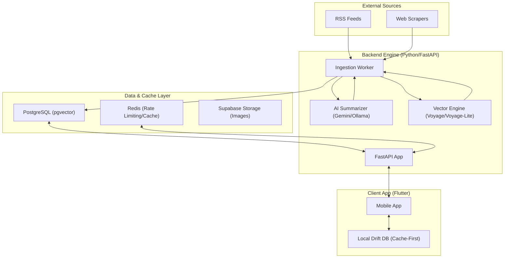

# Currenta System Architecture

This document describes the high-level architecture of Currenta, the data flow, and the technical decisions behind the core engine.

---

## 🏗️ High-Level System Overview

Currenta follows a modern, decoupled architecture centered around a high-performance news pipeline and a vector-aware mobile application.

---

## 🌪️ The Ingestion Pipeline

The ingestion engine is a multi-stage pipeline designed for **high precision** and **low noise**.

1.  **Discovery**: Tracks 180+ RSS feeds and custom scrapers (e.g., TechCrunch).
2.  **Junk Filtering**: A regex-based "Deterministic Gate" blocks betting, sports previews, and live-blogs before they hit the LLM.
3.  **AI Processing**:
    *   **Summarization**: Generates a strict 65-word summary (5Ws) and extracts metadata.
    *   **Classification**: Assigns multiple categories and identifies content "type" (Analysis, Hard News, etc.).
    *   **Locality Detection**: Determines if an article is locally relevant to specific regions (e.g., Kenya).
    *   **Event key**: A framing-free one-sentence statement of the underlying news event (`articles.event_key`), used only for dedup — two outlets covering the same event produce near-identical keys.
4.  **Embedding**: Two 1024-dim vectors — `articles.embedding` = embed(title + summary), used for personalization/trending/related; `articles.dedup_embedding` = embed(event_key), used only by dedup.
5.  **Deduplication**:
    *   *Ingest-time (semantic)*: `find_cluster_match` compares `dedup_embedding` cosine similarity against articles published in the last `DUPLICATE_LOOKBACK_DAYS` (7); at/above `DUPLICATE_SIMILARITY_THRESHOLD` (0.75) the new article is dropped (logged `DUPLICATE_EMBEDDING`). Using the framing-free event key rather than the full summary keeps genuine same-event coverage above threshold without merging merely-related stories.
    *   *Feed-time (lexical)*: Jaccard similarity on title/summary tokens collapses any near-duplicate headlines that still slip through, per feed page.
6.  **Ranking**: Calculates an initial `ranking_score` using time-decay and trend signals.

---

## 🎯 Recommendation & Personalization

Currenta uses a "Bucketized Interleave" strategy to maintain feed quality and variety.

### 1. Vector Similarity (`pgvector`)
User interactions (likes, views) are used to compute an "Interest Vector." When fetching the feed, the system performs a cosine similarity search against the `articles` table to find stories semantically similar to the user's past interests.

### 2. Portfolio Interleave
The `Diversifier` engine interleaves articles from four distinct buckets:
-   **Personalized (70%)**: Vector-matched stories.
-   **Trending (20%)**: High-momentum stories within the user's enabled categories.
-   **Discovery (10%)**: Random high-quality stories for serendipity within the user's enabled categories.
-   **Global Trending (Fallback)**: Top-tier global news used during cold starts.

For a user with interests set, **every** bucket is constrained to their enabled
categories — disabling a category in the Personalization screen is a hard
opt-out, not just a de-prioritisation. Cold-start users (no interests yet) see
all categories. Subcategory chips work the same way: a de-selected subcategory
under an enabled category is written to `user_muted_subcategories` and hard-filtered
from every bucket (`common_where` in `backend/api/feed.py`, with an L2-prefix
match so muting an L2 slug also hides its L3 children); selected subcategories are
a soft ranking boost (`user_sub_interests`). Both tables speak the canonical
`taxonomy/taxonomy.json` vocabulary — the app bundles that file as an asset
(`assets/taxonomy/taxonomy.json`, kept in sync by `test/taxonomy_asset_parity_test.dart`).

---

## ⚡ Cache-First Strategy

The Flutter application implements a strict cache-first architecture:
-   **Immediate Load**: The UI pulls from a local **Drift (SQLite)** database for sub-100ms startup.
-   **Background Sync**: A reactive repository fetches fresh data from the API and upserts it into local storage.
-   **Reactive Streams**: Any change to the local database (via background sync or user interaction) automatically triggers a UI refresh via Dart Streams.

---

## 🛡️ Security & Scalability

-   **Supabase Auth**: Secure JWT-based authentication for both guest and registered users.
-   **Redis Rate Limiting**: Protects the feed and search endpoints from abuse.
-   **ngrok Tunneling**: Facilitates secure, local-to-remote development without manual IP configuration.
-   **Dockerized Services**: The entire backend (API, Worker, Redis, Caddy) is containerized for consistent deployment.
